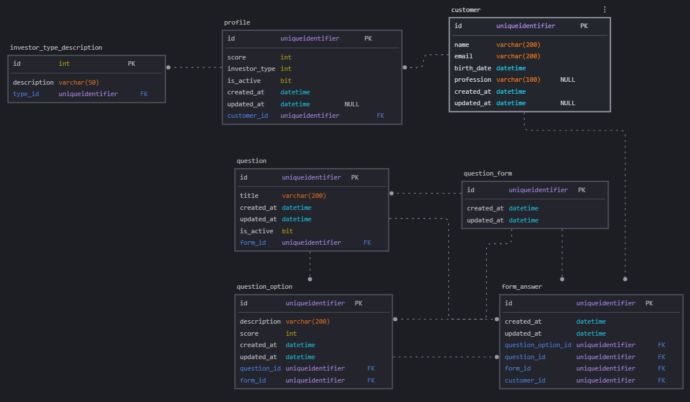

# Customer Profile Service

Este é um dos serviços que compõem a aplicação "WalletProfile", a proposta é ser uma aplicação básica para mapear o perfil de investimento de um usuário e assim sugerir uma carteira de investimentos personalizada com base nisso.

## Propósito do projeto

Este projeto tem como objetivo exercitar algumas práticas relacionadas ao desenvolvimento de aplicações ASP.NET, desde a modelagem do domínio a implementação utilizando padrões conhecidos no mercado.

🔹 Responsável por:

Cadastro de clientes
Definição do perfil de investidor (Conservador, Moderado, Agressivo)

🔹 Como funciona:

Ao criar o cliente, o próprio serviço já calcula o perfil
Pode usar Strategy Pattern internamente

📌 Eventos publicados:

`customer_created_event` — publicado ao criar um novo cliente  
`profile_created_event` — publicado ao criar o perfil de investidor do cliente

----
## Tecnologias utilizadas

- .NET
- RabbitMQ 
- Entity Framework

----

## Integrações

Este serviço terá integração com outros serviços para compor o "WalletProfile", são eles:

- RecommentationService: Voltado para montar as recomendações com base no perfil;
- MarketDataService: Voltado para capturar os dados do mercado em tempo real para servir como parâmetro para as recomendações.

---

## Rotas da API

### Customer — `/api/customer`

| Método | Rota | Descrição | Parâmetros |
|--------|------|-----------|------------|
| GET | `/api/customer` | Busca um cliente pelo ID | `id` (query param, `Guid`) |
| POST | `/api/customer` | Cria um novo cliente | Body: `CreateCustomerRequest` |

---

### Form — `/api/form`

| Método | Rota | Descrição | Parâmetros |
|--------|------|-----------|------------|
| GET | `/api/form` | Busca um formulário pelo ID | `id` (query param, `Guid`) |
| GET | `/api/form/most-recent` | Retorna o formulário mais recente | — |
| POST | `/api/form` | Cria um novo formulário | — |
| POST | `/api/form/question` | Adiciona uma questão ao formulário | Body: `CreateQuestionRequest` |

---

### Profile — `/api/profile`

| Método | Rota | Descrição | Parâmetros |
|--------|------|-----------|------------|
| POST | `/api/profile` | Cria um novo perfil | — |

---

## Modelagem do Banco de Dados

----

Desenvolvido por https://github.com/BernardoS/